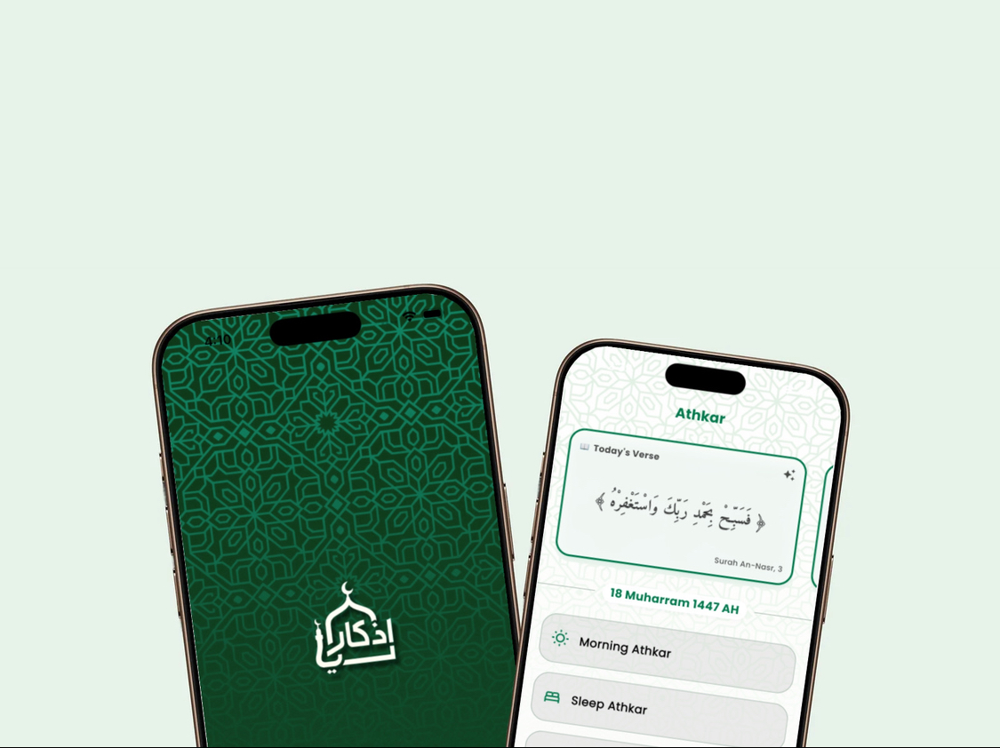
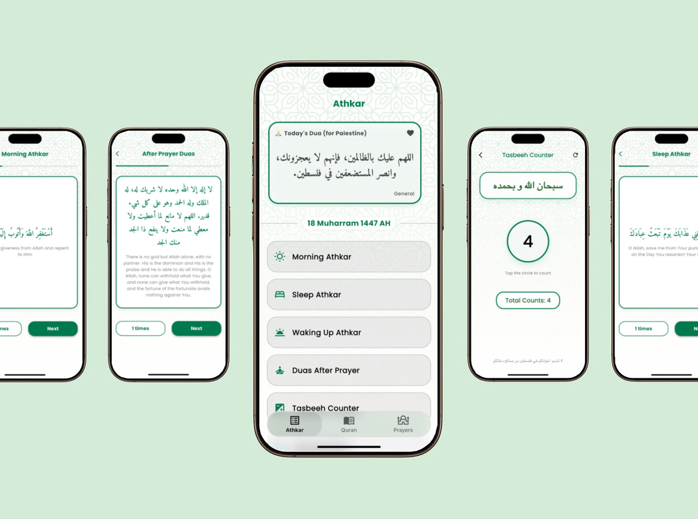
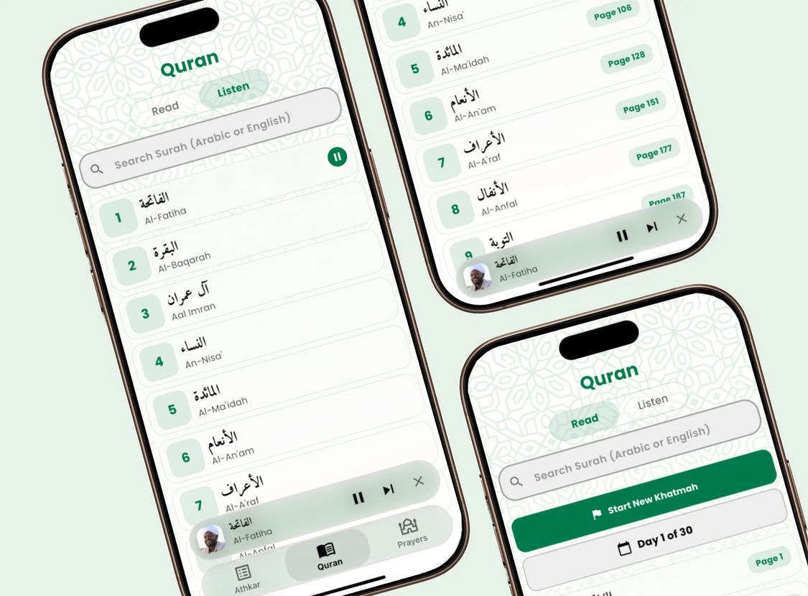
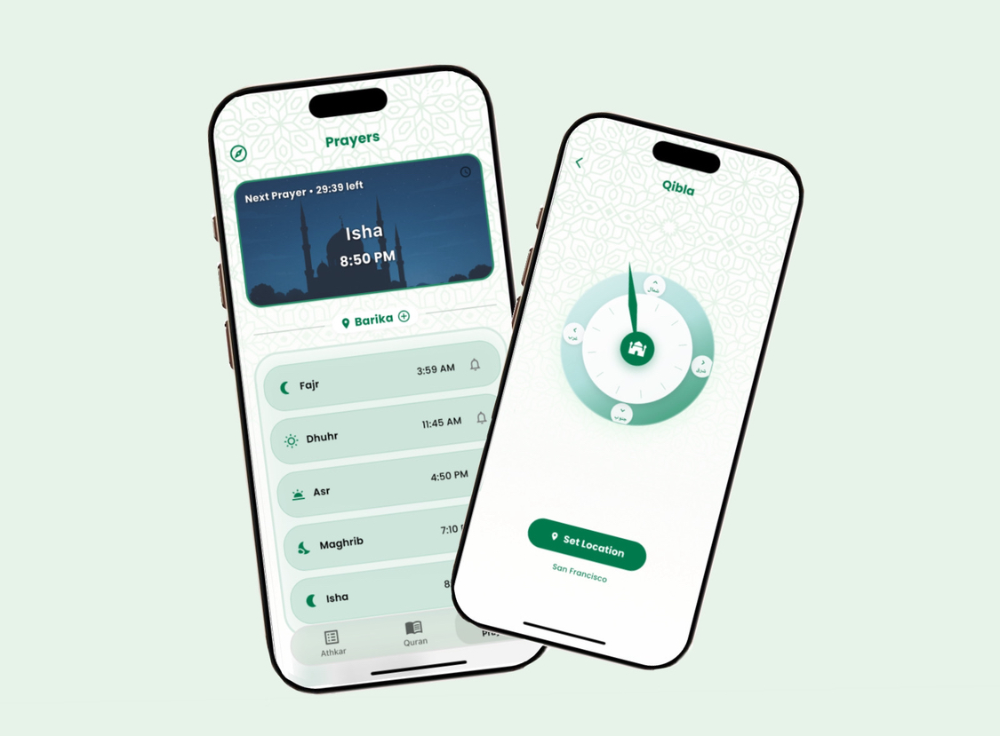
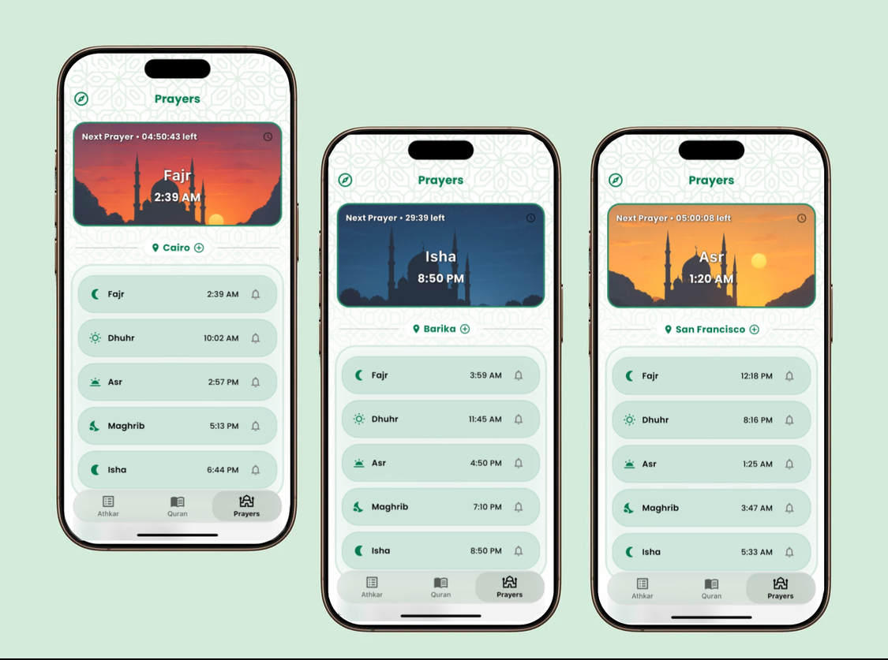
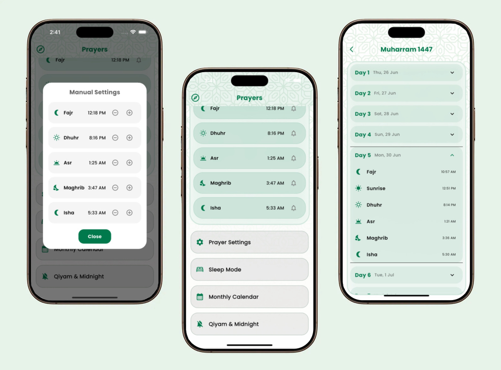

# Athkari

[](https://github.com/thabet1thabet1/athkari)

---

## 🔗 Links
- **GitHub Repository:** [https://github.com/thabet1thabet1/athkari](https://github.com/thabet1thabet1/athkari)
- **LinkedIn:** [Thabet Charef Khodja](https://www.linkedin.com/in/thabet-charef-khodja-97ab03347/)

---

## 📱 Screenshots

<p align="center">
  
  
  
  
  
  
</p>

---

## ✨ Features

- **Morning, Evening, Sleep, and Waking Up Athkar**  
  - Authentic remembrances with Arabic text, translation, and repeat counter.
  - Beautiful, scrollable cards with progress tracking and iOS-style completion dialogs.

- **Duas After Prayer**  
  - Official post-salah supplications, including Ayat al-Kursi and the three Quls.

- **Quran**  
  - Read and listen to the Quran with Uthmani script and audio recitation.
  - Surah navigation, search, and Khatmah (completion) tracking.

- **Prayer Times**  
  - Accurate daily prayer times based on your location.
  - Next prayer countdown, notifications, and monthly calendar.

- **Qibla Direction**  
  - Compass to find the Qibla direction from your current location.

- **Tasbeeh Counter**  
  - Simple, elegant digital counter for dhikr.

- **Modern UI/UX**  
  - Consistent, elegant design with Amiri font for Arabic and Poppins for English.
  - Responsive layouts, glassmorphic effects, and beautiful backgrounds.

---

## 🚀 Getting Started

1. **Clone the repository:**
   ```sh
   git clone https://github.com/thabet1thabet1/athkari.git
   cd athkari
   ```

2. **Install dependencies:**
   ```sh
   flutter pub get
   ```

3. **Run the app:**
   ```sh
   flutter run
   ```

---

## 📂 Project Structure

- `lib/`
  - `core/` – Theme, constants, and services
  - `data/` – Static data (e.g., verses)
  - `ui/screens/` – All main screens (Athkar, Quran, Prayers, etc.)
  - `ui/widgets/` – Reusable UI components
  - `images/` – App images and icons
  - `screenshots/` – App screenshots for documentation

---

## 🛠️ Tech Stack

- **Flutter** (cross-platform mobile)
- **Dart** (programming language)
- **Google Fonts** (Amiri, Poppins)
- **Location & Geocoding** (for prayer times and Qibla)
- **just_audio** (Quran recitation)
- **Shared Preferences** (local storage)

---

## 📜 License

This project is for educational and personal use. Please respect the rights of Quranic and Islamic content.

---

## 🙏 Contributing & Support

- Found a bug or have a feature request? [Open an issue](https://github.com/thabet1thabet1/athkari/issues) or submit a pull request.
- Connect with me on [LinkedIn](https://www.linkedin.com/in/thabet-charef-khodja-97ab03347/) for questions, feedback, or collaboration opportunities.

---

## 📧 Contact

For any questions, suggestions, or professional inquiries, feel free to reach out via [LinkedIn](https://www.linkedin.com/in/thabet-charef-khodja-97ab03347/) or through the [GitHub repository](https://github.com/thabet1thabet1/athkari).

---
